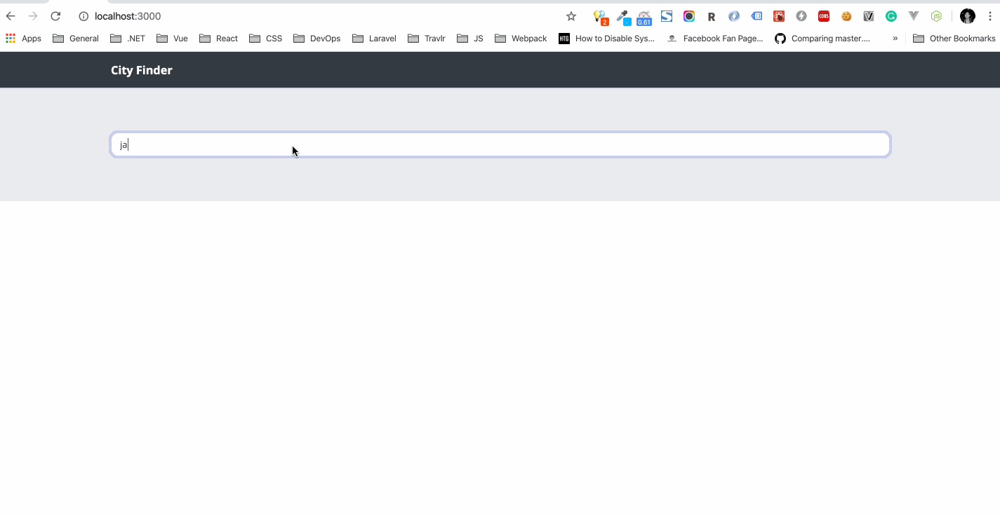
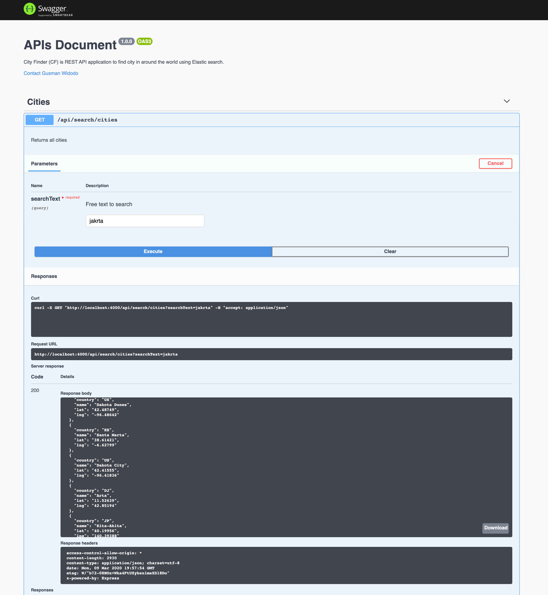

# City Finder
A simple application to find city around the world using Elasticsearch.

## Basic Architecture

> "Micro application using Express and React"

## Prerequisites
- Node ^12.7.0
- ELK server, using docker image: [https://hub.docker.com/r/sebp/elk/](https://hub.docker.com/r/sebp/elk/)

> Note: For your information, i'm using mac in development stage.

## How to
### 1. Clone repository
```shell
git clone https://github.com/gusmanwidodo/city-finder.git

cd city-finder
```
### 2. Run
> Backend

```shell
cd ~/city-finder/server
yarn install
yarn build
yarn dev
```
> Client

```shell
cd ~/city-finder/client
yarn install
yarn start
```

## Screenshots
> Single Page Application:




## API Documentation (OpenApis 3.x):
- Swagger-url: http://localhost:4000/api-docs
- 


## Structure
> Server
```shell
.
├── data
│   └── cities.json
├── dist
│   ├── ...
├── nodemon.json
├── package.json
├── src
│   ├── AppServer.ts
│   ├── controllers
│   │   ├── HomeController.ts
│   │   ├── SearchController.ts
│   │   └── index.ts
│   ├── index.ts
│   ├── libs
│   │   ├── elasticsearch.ts
│   │   └── swagger.ts
│   ├── openAPI
│   │   └── cities.swagger.ts
│   └── types
│       └── City.ts
├── tsconfig.json
├── tslint.json
└── yarn.lock

```

> Client
```shell
.
├── build
│   ├── ...
├── package.json
├── public
│   ├── favicon.ico
│   ├── index.html
│   └── manifest.json
├── src
│   ├── App.js
│   ├── containers
│   │   └── Home
│   │       └── Home.js
│   ├── index.js
│   ├── scss
│   │   ├── _variables.scss
│   │   └── styles.scss
│   └── serviceWorker.js
└── yarn.lock
```


## Contact:
- [Gusman Widodo (LinkedIn)](https://www.linkedin.com/in/gusmanwidodo)

